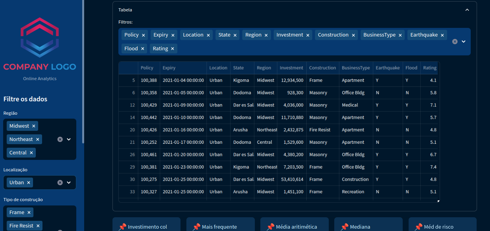
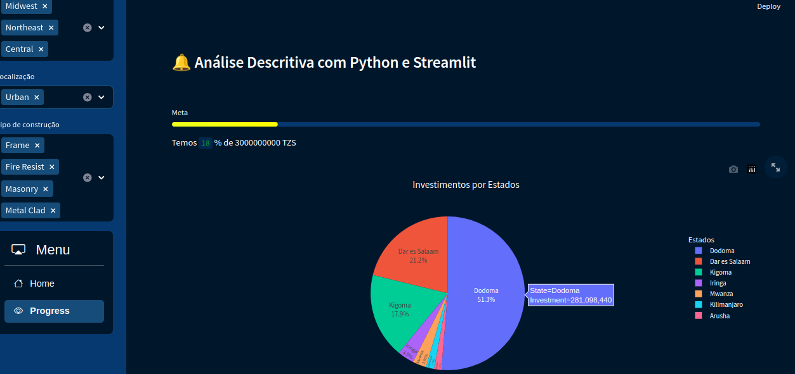

# Análise descritiva de dados

A análise descritiva é um tipo de análise de dados que observa dados passados para descrever o que aconteceu. Os resultados geralmente são apresentados em relatórios, painéis de controle, gráficos de barras e outras visualizações de fácil compreensão.

As estatísticas descritivas fornecem resumos simples sobre a amostra e sobre as observações que foram feitas. Esses resumos podem ser tanto quantitativos, ou seja, estatísticas de resumo, quanto visuais, ou seja, gráficos simples de entender. Esses resumos podem servir como base para a descrição inicial dos dados como parte de uma análise estatística mais extensa, ou podem ser suficientes por si só para uma investigação específica.

## Execute o projeto

Clone o projeto e instale os requerimentos:

```bash
pip install -r requirements.txt
```

Execute o streamlit:

```bash
streamlit run Home.py
```

## Etapa 1: Criando e Populando a Base de Dados

### Configurando o Ambiente com Docker

Para começar, configuramos um ambiente de banco de dados PostgreSQL com a ajuda do Docker. Utilizar o Docker oferece uma maneira eficaz de criar ambientes isolados para desenvolvimento. Execute o seguinte comando para criar um contêiner PostgreSQL:

```bash
docker run --name mypostgres -e POSTGRES_PASSWORD=mysecretpassword -p 5432:5432 -d postgres
```

Neste comando:

- `mypostgres` é o nome do contêiner.
- `POSTGRES_PASSWORD` é a senha do banco de dados (substitua por sua senha).
- `5432:5432` mapeia a porta local 5432 para a porta do PostgreSQL.
- `postgres` é a imagem do PostgreSQL que será baixada automaticamente.

### Criando a Base de Dados

Com o ambiente PostgreSQL configurado, usei a ferramenta Beekeeper para se conectar ao banco de dados e criar a base de dados denominada "insurance" executando o seguinte comando SQL:

```sql
CREATE DATABASE insurance;
```

### Populando a Base de Dados

Agora, para criar e popular a base de dados com os dados do arquivo CSV, utilizei Python em conjunto com as bibliotecas Pandas e SQLAlchemy. O código a seguir cria uma tabela no banco de dados e a popula com os dados do DataFrame construído a partir do arquivo "insurance.csv":

```python
df.to_sql("insurance", engine, if_exists="replace", index=True)
```

Esse processo é realizado de maneira eficiente, permitindo a análise dos dados em um banco de dados PostgreSQL com facilidade.

Todas essas etapas podem ser consultadas e executadas no arquivo [resources/createDB.py](resources/createDB.py) para maior clareza e reprodutibilidade do processo.

## Etapa 02: Configurando a página

Configurei algumas opções gerais da página usando st.set_page_config(), como o título, um ícone e o layout(configurado como "wide" para ocupar mais espaço horizontal na tela).

Em seguida, eu inicializei uma variável theme_plotly com None, que será usada para configurar  a aparência dos gráficos Plotly.

```python
st.set_page_config(page_title="Dashboard", page_icon="🌍", layout="wide")
st.subheader("🔔 Análise Descritiva com Python e Streamlit")
st.markdown("##")

theme_plotly = None
```

## Etapa 03: Constuindo filtros

Depois, eu obtive dados do banco de dados chamando a função `view_all_data()` e os coloquei em um DataFrame pandas chamado df. Os nomes das colunas do DataFrame são definidos para incluir informações sobre políticas de seguros, como "Policy", "Expiry", "Location", "State", "Region", "Investment", "Construction", "BusinessType", "Earthquake", "Flood", e "Rating".

Adicionei um logotipo usando st.sidebar.image e um título "Filtre os dados". Em seguida, criei três opções de seleção múltipla para permitir ao usuário filtrar os dados com base na região, localização e tipo de construção.

```python

# filtros
st.sidebar.header("Filtre os dados")
region=st.sidebar.multiselect(
    "Região",
     options=df["Region"].unique(),
     default=df["Region"].unique(),
)
location=st.sidebar.multiselect(
    "Localização",
     options=df["Location"].unique(),
     default=df["Location"].unique(),
)
construction=st.sidebar.multiselect(
    "Tipo de construção",
     options=df["Construction"].unique(),
     default=df["Construction"].unique(),
)

df_selection=df.query(
    "Region==@region & Location==@location & Construction ==@construction"
)
```

## Etapa 04: Montando um menu no Sidebar

Quero criar um menu interativo que contenha duas páginas para exibir os gráficos. Para isso, crio uma função chamada sideBar, que cria um menu lateral e um superior. O menu contém duas opções principais: "Home" e "Progress". O usuário pode selecionar uma dessas opções para interagir com diferentes partes do aplicativo.

```python
def sideBar():
       
    with st.sidebar:
       selected=option_menu(
           menu_title="Menu",
           options=["Home","Progress"],
           icons=["house","eye"],
           menu_icon="cast",
           default_index=0
       )
    if selected=="Home":
    #    st.subheader(f"Página: {selected}")
       Home()
       graphs()
    if selected=="Progress":
    #    st.subheader(f"Página: {selected}")
       progress_bar()
       graphs()
```

## Etapa 05: Construindo a página Home

Começo mostrando um conjunto de dados tabular com a função `st.expander` para criar uma tabela que pode ser expandida ou recolhida onde o usuário pode escolher quais colunas desejava ver usando a função `st.multiselect`.

```python
with st.expander("Tabela"):
        showData=st.multiselect('Filtros: ',df_selection.columns,default=[])
        st.write(df_selection[showData])
```

Em seguida, calculo algumas métricas como investimento total, a moda do investimento, a média do investimento, a mediana do investimento e o risco médio. Para apresentá-las de forma clara, um layout de cinco colunas para organizar as informações.

```python
investimento_total = float(df_selection['Investment'].sum())
investimento_moda = float(df_selection['Investment'].mode())
investimento_media = float(df_selection['Investment'].mean())
investimento_mediana = float(df_selection['Investment'].median())
risco_medio = float(df_selection['Rating'].mean())
```

## Etapa 06: Construindo gráficos

Em um gráfico de barras horizontais agrupo os dados por tipo de negócio (BusinessType) e conto quantos investimentos existem em cada categoria. Em seguida, classifico essas categorias com base no número de investimentos. Isso permitirá que o usuário veja facilmente em qual tipo de negócio foram feitos mais investimentos.

```python
investimento_por_business = df_selection.groupby(by=["BusinessType"]).count()[["Investment"]].sort_values(by="Investment")

fig_investment=px.bar(
    investimento_por_business,
    x="Investment",
    y=investimento_por_business.index,
    orientation="h",
    title="<b> Investmento por Tipo de negócio </b>",
    color_discrete_sequence=["#0083B8"]*len(investimento_por_business),
    template="plotly_white",
)
```

Crio uma segunda visualização, como um gráfico de linhas. Os dados são agrupados por estado (State) e conto quantos investimentos existem em cada estado. O gráfico de linhas permitirá ao usuário acompanhar como o número de investimentos varia de estado para estado.

```python
investment_state=df_selection.groupby(by=["State"]).count()[["Investment"]]
    
fig_state=px.line(
    investment_state,
    x=investment_state.index,
    y="Investment",
    orientation="v",
    title="<b> Investmentos por Estado </b>",
    color_discrete_sequence=["#0083b8"]*len(investment_state),
    template="plotly_white",
)
```

Para apresentar esses gráficos, um layout de duas colunas. Isso permite que o usuário visualize ambas as visualizações lado a lado e compare os dados com facilidade.

```python
col1,col2=st.columns(2)
col1.plotly_chart(fig_state,use_container_width=True)
col2.plotly_chart(fig_investment,use_container_width=True)
```

## Etapa 07: Página de progresso

Dentro da função "progress_bar", crio uma barra de progresso para acompanhar o progresso em direção a uma meta de investimento. Adiciono um estilo CSS à barra de progresso, que permite uma transição de cores de verde para amarelo, dando um visual atraente e informativo.

Defino a meta de investimento como 3.000.000.000 (três bilhões) e calculo o valor atual do investimento somando todos os investimentos da seleção de dados. Também calculo a porcentagem de progresso em direção à meta. Isso é importante para que os usuários possam visualizar o quão perto estão de atingir a meta.

Cria a barra de progresso usando `st.progress(0)` e, em seguida, inicio um loop para atualizar a barra de progresso. Se a porcentagem ultrapassar 100%, ele exibirá a mensagem "Meta alcançada!". Caso contrário, ele mostrará o progresso atual em termos de porcentagem e valor total da meta.

Durante o loop, a barra de progresso é atualizada em incrementos, e a função "sleep(0.1)" é usada para criar uma animação suave do progresso. Isso ajuda os usuários a acompanhar o progresso de forma visual.

```python
st.markdown("""<style>.stProgress > div > div > div > div { background-image: linear-gradient(to right, #99ff99 , #FFFF00)}</style>""",unsafe_allow_html=True,)
target=3000000000
current=df_selection["Investment"].sum()
percent=round((current/target*100))
mybar=st.progress(0)

if percent>100:
    st.subheader("Meta alcançada!")
else:
    st.write("Temos ",percent, "% " ,"de ", (format(target, 'd')), "TZS")
    for percent_complete in range(percent):
        sleep(0.1)
        mybar.progress(percent_complete+1,text=" Meta")
```

Além da barra de progresso, para finalizar adiciono e edito um gráfico de pizza que exibe as classificações por estado com `st.plotly_chart`.

```python
fig = px.pie(df_selection, values='Investment', names='State', title='Investimentos por Estados')
fig.update_layout(legend_title="Estados", legend_y=0.9)
fig.update_traces(textinfo='percent+label', textposition='inside')
st.plotly_chart(fig, use_container_width=True, theme=theme_plotly)
```




